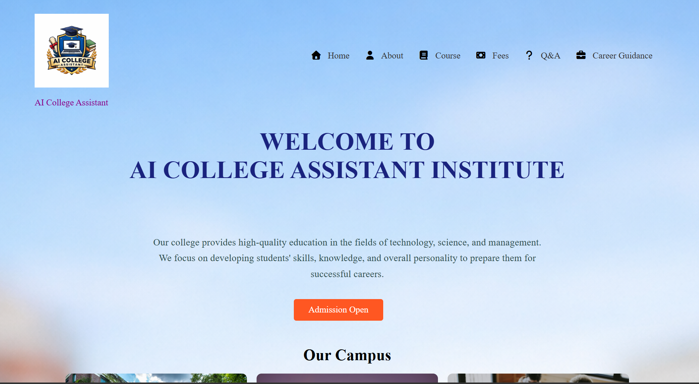

# AI - Assistant College Website 🎓

This is a beginner-level AI college website project created for learning and academic purposes.

An AI-powered college website developed to provide students with an interactive and modern platform for accessing college information, notices, courses, and student resources.

---

## 🌐 Live Demo

🚀 [Visit Website](https://13swetajha.github.io/Ai-Assistant-College-website/)

---

## ✨ Features

- Responsive College Website
- AI Assistant Section
- Modern UI Design
- Course Information
- Contact Page

---

## 🛠️ Tech Stack

- HTML
- CSS
- JavaScript

---

## 📸 Screenshots

### Website Preview



---

## 📂 Folder Structure

```bash
Ai-Assistant-College-website/
│── index.html
│── style.css
│── script.js
│── images/
```

---

👩‍💻 Project Development

This project was fully designed and developed by me.

##👍 Work Done
Designed complete frontend interface
Created responsive layouts using HTML & CSS
Added animations and modern UI
Developed interactive sections using JavaScript
Managed overall website structure and styling

---

## 🚀Future Improvements
AI Chatbot Integration
Student Login System
Online Admission Feature
Dark Mode Support


